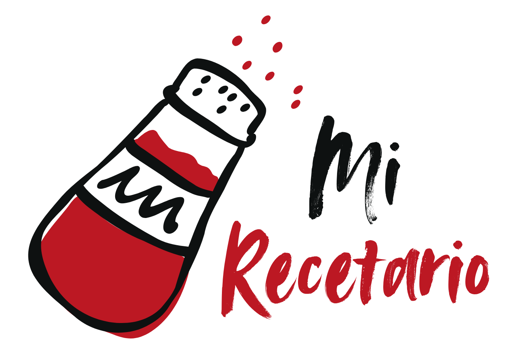

Libro de recetas personal, para un rapido acceso multiplataforma. Las recetas se guardan en un archivo JSON editable.

## Estructura

```
recetario/
├── index.html        ← página principal
├── recetas.json      ← recetas (para editar)
├── vercel.json       ← configuración de Vercel
├── css/
│   └── style.css
└── js/
│   └── app.js
└── assets/
    └── logo.png

```


---

### categorias: 
-  'Panes y masas':      '🍞',
-  'Postres':            '🍮',
-  'Cafetería':          '☕',
-  'Pastelería':         '🥐',
-  'Tragos y bebidas':   '🍹',
-  'Sopas y caldos':     '🍲',
-  'Pastas':             '🍝',
-  'Salsas y aderezos':  '🥣',
-  'Snacks y aperitivos':'🍟',
-  'Platos principales': '🥘',
-  'Tartas y quiches':   '🥧',
-  'Entradas':           '🧆',
-  'Ensaladas':          '🥗',
-  'Desayunos':          '🍳',
-  'Guarniciones':       '🍚',
-  'Ingredientes':       '🧂',

---

### Informacion para cada receta en el json
```
{"id" : "",
"titulo" : "",
"categoria" : "",
"tiempo" : "",
"porciones" : ,
"porcion_unidad" : "",
"dificultad" : "",
"descripcion" : "",
"ingredientes" : [],
"pasos" : [],
"tips" : [],
"etiquetas" : [],
"imagen" : "https://kirolab3d.tienda-online.com/server/Portal_0009770/img/products/no_image_xxl.jpg"
}

